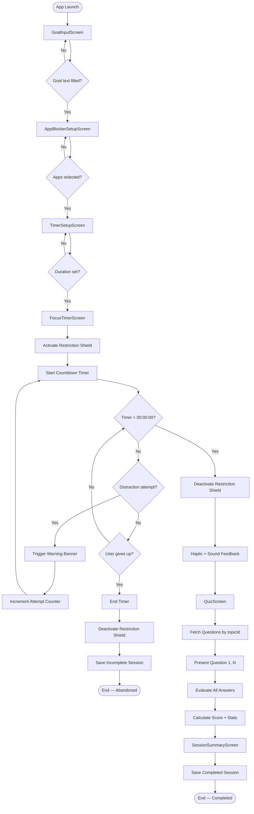
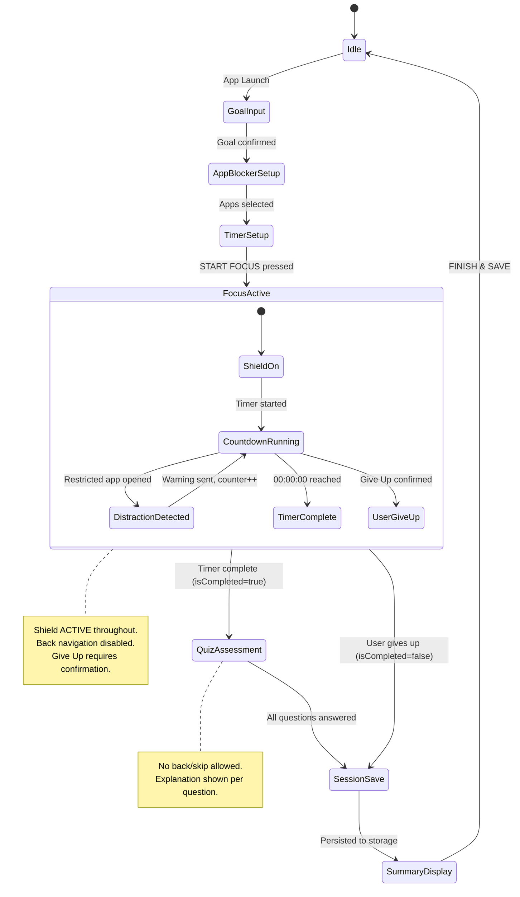
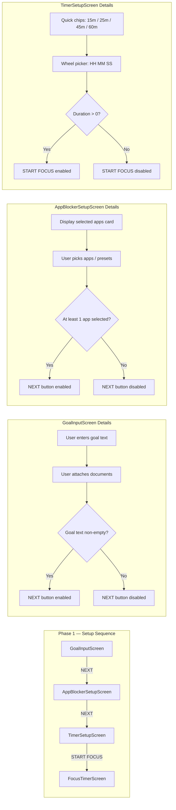
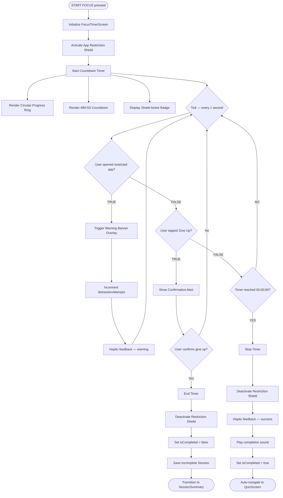
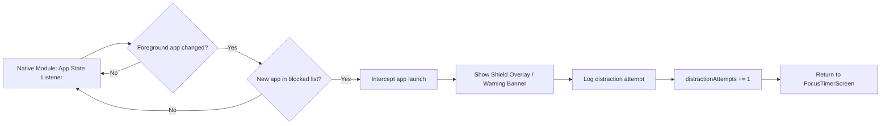
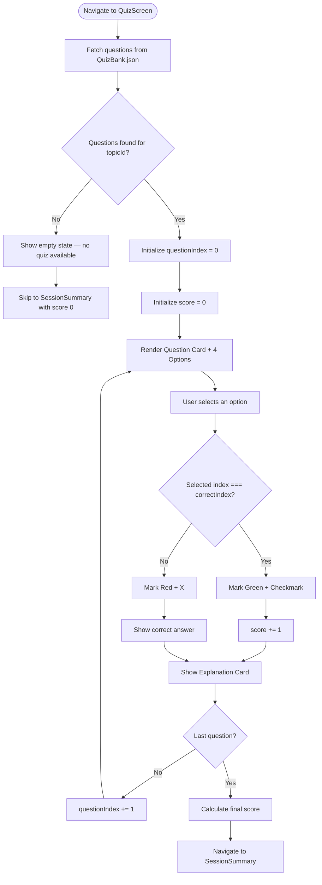
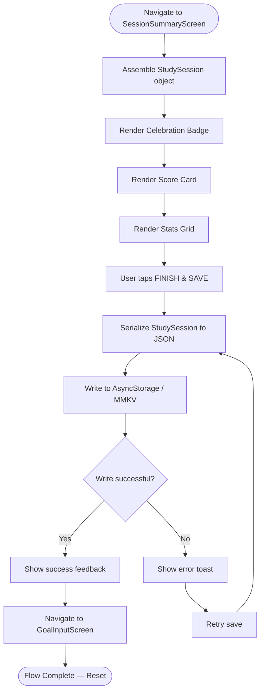
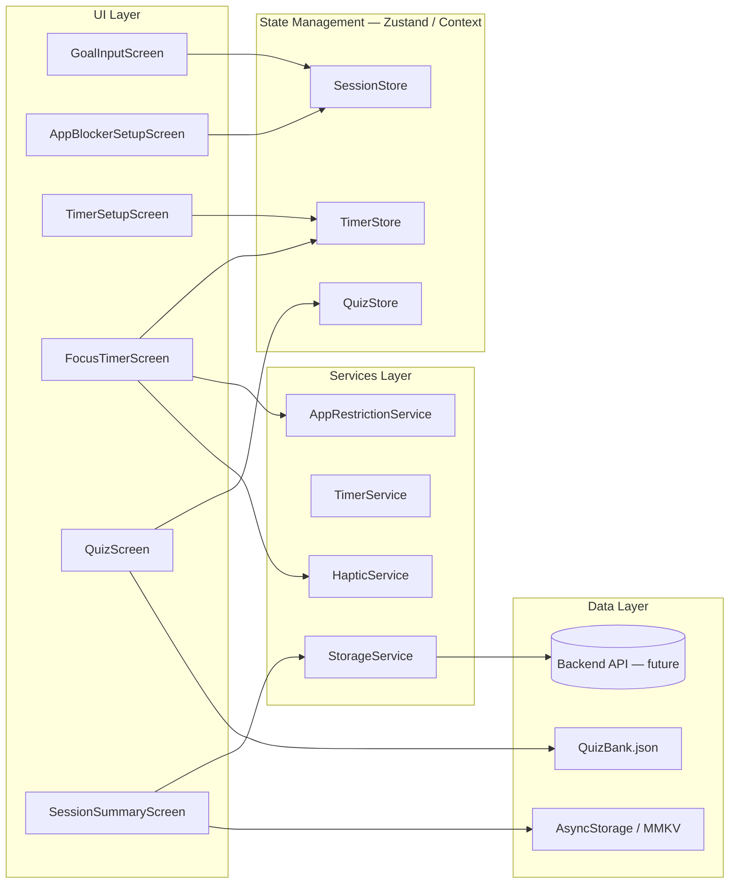
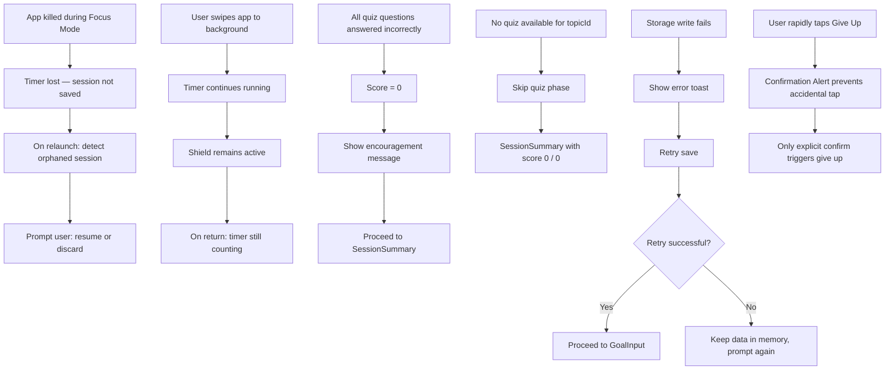

# Focus Mode — System Logic Flowchart

> **Project:** Pomodoro Focus & App Restrictor (React Native MVP)
> **Scope:** Complete focus lifecycle — from setup to session persistence
> **Last Updated:** 2026-10-01

---

## Table of Contents

1. [System Overview](#1-system-overview)
2. [High-Level Flowchart](#2-high-level-flowchart)
3. [State Machine — Focus Mode Lifecycle](#3-state-machine--focus-mode-lifecycle)
4. [Phase 1: Setup Sequence](#4-phase-1-setup-sequence)
5. [Phase 2: Focus Timer & Distraction Loop](#5-phase-2-focus-timer--distraction-loop)
6. [Phase 3: Quiz Assessment](#6-phase-3-quiz-assessment)
7. [Phase 4: Session Summary & Persistence](#7-phase-4-session-summary--persistence)
8. [Complete State Transition Table](#8-complete-state-transition-table)
9. [Data Flow Diagram](#9-data-flow-diagram)
10. [Edge Cases & Error Handling](#10-edge-cases--error-handling)

---

## 1. System Overview

Focus Mode is the core engine of the app. It orchestrates four sequential phases:

| Phase | Screen(s) | Key Responsibility |
|-------|-----------|-------------------|
| **Setup** | GoalInput → AppBlockerSetup → TimerSetup | Collect goal, blocked apps, duration |
| **Focus** | FocusTimer | Run countdown, enforce app restriction, track distractions |
| **Assessment** | Quiz | Present topic quiz, calculate score |
| **Summary** | SessionSummary | Display stats, persist session, reset flow |

The system is governed by a **finite state machine** with two terminal outcomes:
- **Completed** — timer reached 00:00:00, quiz taken, session saved as `isCompleted: true`
- **Abandoned** — user gave up early, session saved as `isCompleted: false`

---

## 2. High-Level Flowchart



---

## 3. State Machine — Focus Mode Lifecycle



---

## 4. Phase 1: Setup Sequence

### 4.1 Setup Flowchart



### 4.2 Setup Data Collected

| Field | Source | Type | Required |
|-------|--------|------|----------|
| `goalText` | GoalInputScreen | `string` | Yes |
| `topicId` | Derived from goal / document | `string` | Yes |
| `attachedDocuments` | GoalInputScreen | `Document[]` | No |
| `blockedApps` | AppBlockerSetupScreen | `AppInfo[]` | Yes |
| `targetDurationSeconds` | TimerSetupScreen | `number` | Yes |

---

## 5. Phase 2: Focus Timer & Distraction Loop

### 5.1 Focus Timer Flowchart



### 5.2 Distraction Detection Sub-Flow



### 5.3 Focus Timer State Variables

| Variable | Type | Initial | Description |
|----------|------|---------|-------------|
| `remainingSeconds` | `number` | `targetDurationSeconds` | Countdown value |
| `distractionAttempts` | `number` | `0` | Count of blocked app open attempts |
| `isShieldActive` | `boolean` | `true` | Restriction shield state |
| `isTimerRunning` | `boolean` | `true` | Timer tick state |
| `isCompleted` | `boolean` | `false` | Session completion flag |
| `actualDurationSeconds` | `number` | `0` | Filled at timer end |

---

## 6. Phase 3: Quiz Assessment

### 6.1 Quiz Flowchart



### 6.2 Quiz State Variables

| Variable | Type | Initial | Description |
|----------|------|---------|-------------|
| `questions` | `QuizQuestion[]` | `[]` | Fetched from QuizBank |
| `currentQuestionIndex` | `number` | `0` | Current question pointer |
| `score` | `number` | `0` | Running correct answer count |
| `selectedOptionIndex` | `number \| null` | `null` | User's current selection |
| `showExplanation` | `boolean` | `false` | Explanation card visibility |
| `isAnswerCorrect` | `boolean \| null` | `null` | Result of current selection |

---

## 7. Phase 4: Session Summary & Persistence

### 7.1 Summary & Save Flowchart



### 7.2 StudySession Object Assembly

```typescript
const session: StudySession = {
  id: generateUUID(),
  goalText: goalText,
  topicId: topicId,
  targetDurationSeconds: targetDurationSeconds,
  actualDurationSeconds: actualDurationSeconds,
  distractionAttempts: distractionAttempts,
  quizScore: quizScore,
  totalQuizQuestions: totalQuizQuestions,
  isCompleted: isCompleted,
  timestamp: new Date().toISOString(),
};
```

### 7.3 Summary Display Data

| Stat | Source | Format |
|------|--------|--------|
| Focus Duration | `actualDurationSeconds` | `MM:SS` or `HH:MM:SS` |
| Topic Studied | `goalText` | Text |
| Distraction Count | `distractionAttempts` | Integer |
| Apps Blocked | `blockedApps.length` | Integer |
| Quiz Score | `quizScore / totalQuizQuestions` | `X / Y Correct` |

---

## 8. Complete State Transition Table

| # | Current State | Event / Condition | Next State | Side Effects |
|---|--------------|-------------------|------------|--------------|
| 1 | `Idle` | App launch | `GoalInput` | — |
| 2 | `GoalInput` | Goal text filled + NEXT | `AppBlockerSetup` | Store `goalText`, `topicId` |
| 3 | `AppBlockerSetup` | Apps selected + NEXT | `TimerSetup` | Store `blockedApps[]` |
| 4 | `TimerSetup` | Duration set + START FOCUS | `FocusActive` | Store `targetDurationSeconds` |
| 5 | `FocusActive` | Shield activated | `CountdownRunning` | `isShieldActive = true` |
| 6 | `CountdownRunning` | Restricted app opened | `DistractionDetected` | — |
| 7 | `DistractionDetected` | Warning shown | `CountdownRunning` | `distractionAttempts++` |
| 8 | `CountdownRunning` | Timer reaches 00:00:00 | `TimerComplete` | `isCompleted = true` |
| 9 | `CountdownRunning` | Give Up confirmed | `UserGiveUp` | `isCompleted = false` |
| 10 | `TimerComplete` | Shield deactivated | `QuizAssessment` | `isShieldActive = false`, haptic + sound |
| 11 | `UserGiveUp` | Shield deactivated | `SessionSave` | `isShieldActive = false` |
| 12 | `QuizAssessment` | All questions answered | `SessionSave` | Calculate `quizScore` |
| 13 | `SessionSave` | Persisted to storage | `SummaryDisplay` | Write to AsyncStorage/MMKV |
| 14 | `SummaryDisplay` | FINISH & SAVE | `Idle` | Navigate to `GoalInput` |

---

## 9. Data Flow Diagram



---

## 10. Edge Cases & Error Handling

### 10.1 Edge Case Flowchart



### 10.2 Edge Case Summary

| Edge Case | Handling Strategy |
|-----------|-------------------|
| App killed during focus | Detect orphaned session on relaunch; prompt resume/discard |
| App backgrounded during focus | Timer continues; shield stays active |
| All quiz answers wrong | Score = 0; show encouragement; proceed to summary |
| No quiz for topic | Skip quiz; summary shows `0 / 0` |
| Storage write failure | Error toast + retry loop |
| Rapid Give Up taps | Confirmation Alert guards against accidental activation |
| Empty goal text | NEXT button disabled |
| No apps selected | NEXT button disabled |
| Zero duration | START FOCUS button disabled |

---

## Appendix: Screen-to-Phase Mapping

| Screen | Phase | Key State | Exit Condition |
|--------|-------|-----------|----------------|
| `GoalInputScreen` | Setup | `goalText`, `topicId` | NEXT → AppBlockerSetup |
| `AppBlockerSetupScreen` | Setup | `blockedApps[]` | NEXT → TimerSetup |
| `TimerSetupScreen` | Setup | `targetDurationSeconds` | START FOCUS → FocusTimer |
| `FocusTimerScreen` | Focus | `remainingSeconds`, `distractionAttempts`, `isShieldActive` | Timer end → Quiz; Give Up → Summary |
| `QuizScreen` | Assessment | `questions[]`, `score`, `currentQuestionIndex` | Last question → Summary |
| `SessionSummaryScreen` | Summary | `StudySession` object | FINISH & SAVE → GoalInput |

---

*End of Focus Mode System Logic Flowchart*
